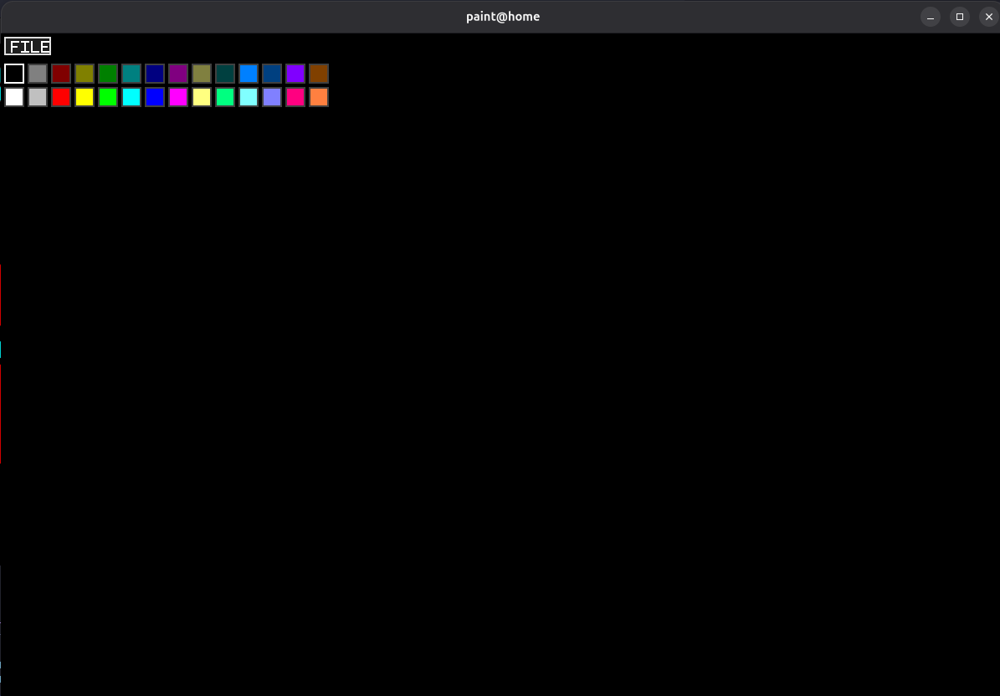
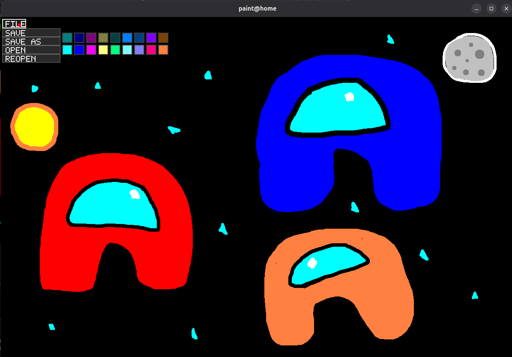

# PAH Paint

A lightweight paint app written in C using SDL2 and SDL2_image.

## Screenshots

### 1) Launch state (blank canvas)



### 2) Art + File dropdown example



## Install Dependencies (Linux)

Install SDL2 and SDL2_image development packages:

```bash
# Ubuntu / Debian
sudo apt install libsdl2-dev libsdl2-image-dev

# Fedora
sudo dnf install SDL2-devel SDL2_image-devel

# Arch
sudo pacman -S sdl2 sdl2_image
```

If you prefer, you can also compile SDL2 and SDL2_image from source.

Official repositories:
- SDL2: https://github.com/libsdl-org/SDL
- SDL2_image: https://github.com/libsdl-org/SDL_image

Follow each repository's build instructions and make sure pkg-config can find both libraries before running `make` for this project.

## Build

Make sure SDL2 and SDL2_image development packages are installed, then run:

```bash
make
```

This builds the app to `bin/paint`.

## Run

```bash
./bin/paint
```

## Clean

```bash
make clean
```
